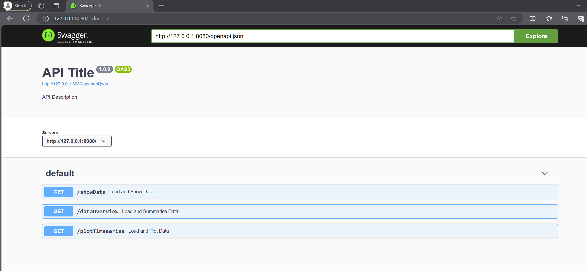
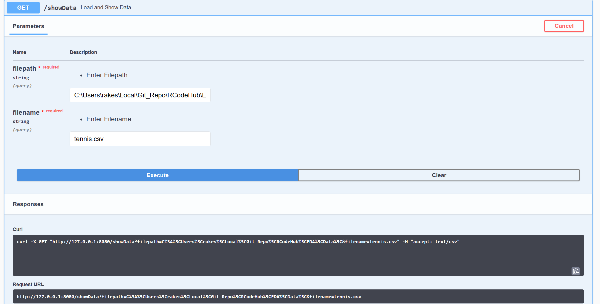
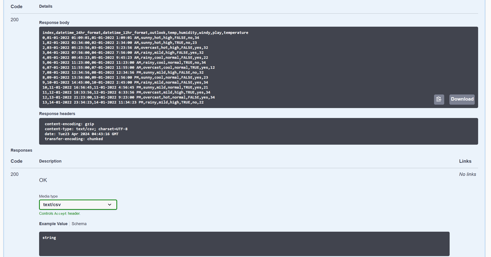
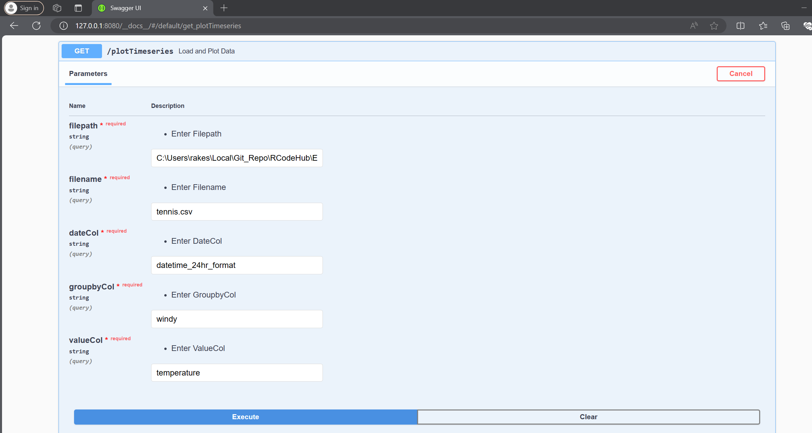
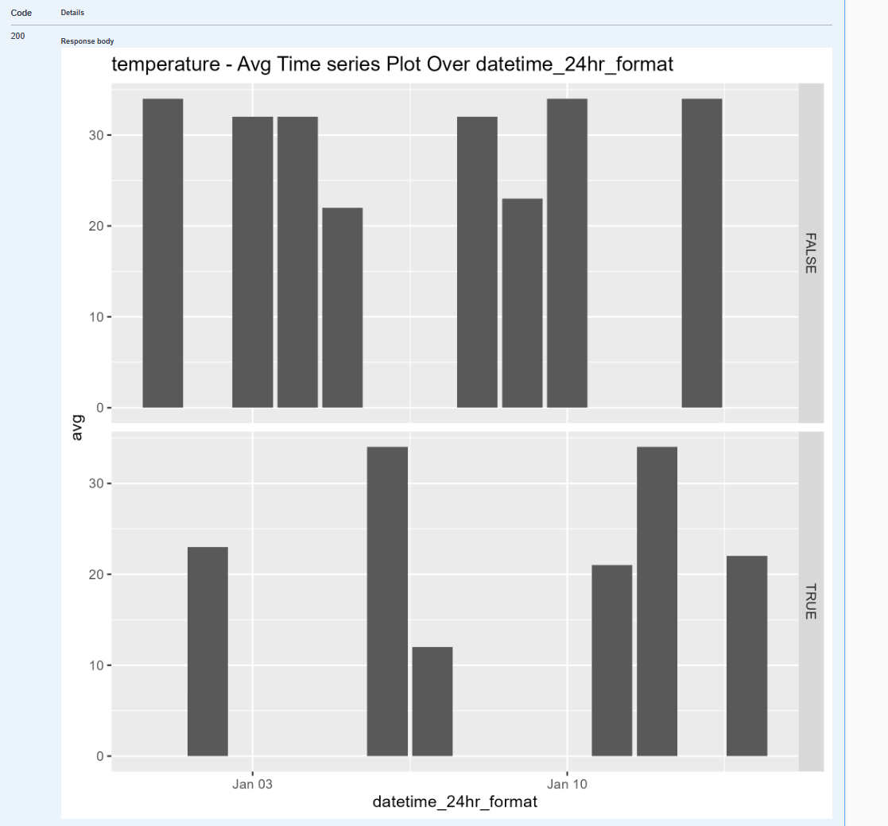

## Plumber API Endpoints Examples

### Run Plumber API App

```shell
# Check R Version
$ "C:\Program Files\R\R-4.3.2\bin\x64\R" --version  
R version 4.3.2 (2023-10-31 ucrt) -- "Eye Holes"

# Check Rscript Version
$ "C:\Program Files\R\R-4.3.2\bin\x64\Rscript" --version 
Rscript (R) version 4.3.2 (2023-10-31)

# Start Plumber API
$ "C:\Program Files\R\R-4.3.2\bin\x64\Rscript" Call_API.R

Running plumber API at http://127.0.0.1:8080
Running swagger Docs at http://127.0.0.1:8080/__docs__/
```

### Swagger API Docs



- **Endpoint : Show Data**
    - 
    - 

Curl execution

```bash
$ curl -X GET "http://127.0.0.1:8080/showData?filepath=C%3A%5CUsers%5Crakes%5CLocal%5CGit_Repo%5CRCodeHub%5CEDA%5CData%5C&filename=tennis.csv" -H "accept: text/csv"

index,datetime_24hr_format,datetime_12hr_format,outlook,temp,humidity,windy,play,temperature        
0,01-01-2022 01:09:01,01-01-2022 1:09:01 AM,sunny,hot,high,FALSE,no,34
1,02-01-2022 02:34:00,02-01-2022 2:34:00 AM,sunny,hot,high,TRUE,no,23
2,03-01-2022 05:23:56,03-01-2022 5:23:56 AM,overcast,hot,high,FALSE,yes,32
3,04-01-2022 07:56:00,04-01-2022 7:56:00 AM,rainy,mild,high,FALSE,yes,32
4,05-01-2022 09:45:23,05-01-2022 9:45:23 AM,rainy,cool,normal,FALSE,yes,22
5,06-01-2022 11:23:00,06-01-2022 11:23:00 AM,rainy,cool,normal,TRUE,no,34
6,07-01-2022 11:55:00,07-01-2022 11:55:00 AM,overcast,cool,normal,TRUE,yes,12
7,08-01-2022 12:34:56,08-01-2022 12:34:56 PM,sunny,mild,high,FALSE,no,32
8,09-01-2022 13:56:00,09-01-2022 1:56:00 PM,sunny,cool,normal,FALSE,yes,23
9,10-01-2022 14:45:00,10-01-2022 2:45:00 PM,rainy,mild,normal,FALSE,yes,34
10,11-01-2022 16:56:45,11-01-2022 4:56:45 PM,sunny,mild,normal,TRUE,yes,21
11,12-01-2022 18:33:56,12-01-2022 6:33:56 PM,overcast,mild,high,TRUE,yes,34
12,13-01-2022 21:23:00,13-01-2022 9:23:00 PM,overcast,hot,normal,FALSE,yes,34
13,14-01-2022 23:34:23,14-01-2022 11:34:23 PM,rainy,mild,high,TRUE,no,22
```

- **Endpoint : Plot Timeseries**
    - 
    - 

Curl execution

```bash
curl -X GET "http://127.0.0.1:8080/plotTimeseries?filepath=C%3A%5CUsers%5Crakes%5CLocal%5CGit_Repo%5CRCodeHub%5CEDA%5CData%5C&filename=tennis.csv&dateCol=datetime_24hr_format&groupbyCol=windy&valueCol=temperature" -H "accept: image/png"
```
